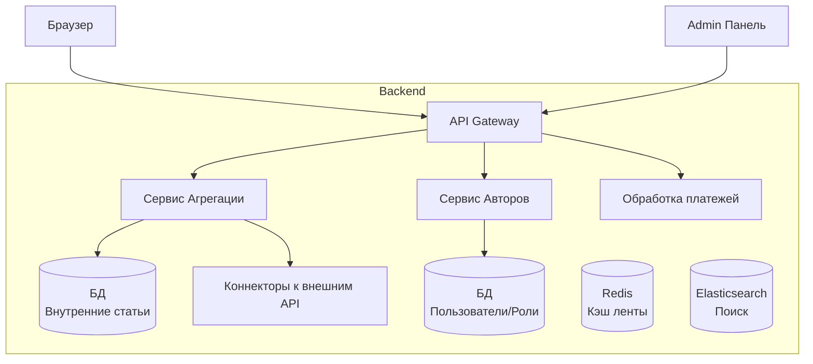

# kpo2025 — Новостная платформа (News Platform)

## Конструирование ПО 2025 - Выработка требований

**Тема:** Модуль новостной платформы с пользовательским контентом

**Авторы:**
- Звелаке Масеко
- Ха Жа Кинь
- Гюнеш Мустафа

**Группа:** 5130904/30103

---

### 1. Основные функции модуля

- **Лента новостей:** Агрегация статей из двух источников:
  - *Внутренние статьи* (от авторов платформы)
  - *Внешние статьи* (из внешних API мировых новостных агентств)
- **Система авторов:** Пользователи могут оформить подписку и получить роль «Автор» для публикации своих статей.
- **Категории и теги:** Фильтрация ленты по разделам.
- **Поиск:** Полнотекстовый поиск по всем статьям (внутренним и внешним).
- **Система уведомлений:** Push-уведомления о новых статьях от любимых авторов.

### 2. Оценка аудитории

- **Суточная активная аудитория (DAU):** ~15 000 пользователей.
- **Активные авторы:** ~5-10% от аудитории (при условии платной подписки на роль автора).
- **Хранение данных:** 5–7 лет.

### 3. Пользовательские сценарии

#### 3.1. Чтение новостей (Читатель)
**Как читатель**, я хочу видеть единую ленту из статей авторов платформы и мировых новостей, чтобы быть в курсе всех событий.
- Пользователь заходит на главную страницу и видит смешанную ленту.
- Может отфильтровать по категории или источнику (только внутренние / только внешние).
- Может подписаться на конкретного автора.

#### 3.2. Получение роли автора (Пользователь -> Автор)
**Как пользователь**, я хочу оформить подписку и получить возможность публиковать свои статьи на платформе.
- Пользователь переходит в раздел «Стать автором».
- Выбирает тариф подписки (месяц/год) и оплачивает через платежную систему.
- После подтверждения оплаты, в личном кабинете появляется доступ к «Панели автора».

#### 3.3. Публикация статьи (Автор)
**Как автор**, я хочу написать и опубликовать статью, чтобы поделиться своим мнением с аудиторией.
- Автор заходит в «Панель автора» и создает новую статью (заголовок, текст, категория, обложка).
- Статья отправляется на модерацию (проверка на плагиат, соответствие правилам).
- После модерации статья появляется в общей ленте.

#### 3.4. Администрирование (Админ)
**Как администратор**, я хочу управлять внешними API и модерировать статьи авторов.
- Подключение нового внешнего API (например, Reuters, BBC) через админ-панель.
- Просмотр очереди статей на модерацию (одобрить/отклонить).
- Управление тарифами подписки для авторов.

---

## Архитектура и проектирование

### 1. Характер нагрузки на сервис

#### 1.1. Соотношение R/W нагрузки
| Раздел            | Чтение       | Запись                    |
| ----------------- | ------------ | ------------------------- |
| Внутренние статьи | 80% (чтение) | 20% (публикация авторами) |
| Внешние статьи    | 99% (чтение) | 1% (загрузка по API)      |

#### 1.2. Источники данных
- **Внутренние статьи:** Хранятся в собственной БД.
- **Внешние статьи:** Получаются через интеграцию с внешними News API (агрегаторы мировых новостей).

### 2. Диаграммы C4 Model

#### 2.1. System Context Diagram (C4 Level 1)

```mermaid
graph TD
    Reader[Читатель] --> Platform[Новостная Платформа]
    Author[Автор<br/>(Подписчик)] --> Platform
    
    Platform --> ExternalAPI[Внешние News API<br/>(мировые новости)]
    Platform --> PaymentSystem[Платежная система<br/>(подписки)]
    
    Admin[Администратор] --> Platform
```

#### 2.2. Container Diagram (C4 Level 2)



### 3. Контракты API

#### 3.1. Получение ленты (внутренние + внешние)
- **Метод:** `GET /api/v1/feed`
- **Параметры:**
  - `page`, `category`, `source` (internal/external/all)
- **Нефункциональные требования:**
  - **Время отклика:** < 300 мс (включая агрегацию из двух источников)

#### 3.2. Оформление подписки на роль автора
- **Метод:** `POST /api/v1/subscriptions/author`
- **Заголовки:** `Authorization: Bearer <JWT>`
- **Тело запроса:** `{ "plan": "monthly", "payment_method": "visa", "payment_token": "..." }`
- **Ответ:** `{ "status": "active", "role": "author", "expires_at": "2025-12-31" }`

#### 3.3. Публикация статьи (только для роли Author)
- **Метод:** `POST /api/v1/articles`
- **Заголовки:** `Authorization: Bearer <JWT>`
- **Тело запроса:** `{ "title": "...", "content": "...", "category_id": 1, "cover_image": "url" }`
- **Ответ:** `{ "id": 123, "status": "pending_moderation" }`

### 4. Схема базы данных

**Основные таблицы:**
- **`users`**: `id`, `email`, `password_hash`, `role` (reader/author/admin), `subscription_expires_at`
- **`articles`**: `id`, `title`, `content`, `author_id` (FK to users), `category_id`, `status` (pending/published/rejected), `published_at`, `source_type` (internal/external)
- **`external_apis`**: `id`, `name` (BBC, Reuters), `api_url`, `api_key`, `sync_interval`
- **`subscriptions`**: `id`, `user_id`, `plan`, `started_at`, `expires_at`, `payment_status`

**Почему схема выдержит нагрузку:**
- **Партиционирование:** Таблица `articles` партиционируется по `published_at` (по годам/месяцам).
- **Кэширование ленты:** Топ-100 статей за сегодня/неделю хранятся в Redis.
- **Full-text search:** Индексы Elasticsearch для быстрого поиска по заголовкам и тексту.

### 5. Дополнительные требования (рекомендации)

1. **Модерация контента:**
   - Автоматическая проверка на плагиат (интеграция с сервисами антиплагиата).
   - Ручная модерация для новых авторов (первые 3 статьи проверяются админом).

2. **Anti-fraud для подписок:**
   - Защита от накруток подписок (лимит на количество подписок с одного IP/карты).

3. **Рейтинг авторов:**
   - Система кармы/рейтинга авторов на основе просмотров и лайков.
   - Авторы с высоким рейтингом проходят модерацию быстрее.

4. **Квоты для авторов:**
   - Ограничение на количество публикаций в день/неделю (в зависимости от тарифа подписки).

5. **Webhook для внешних API:**
   - Внешние новости загружаются не только по расписанию (polling), но и через webhook (если внешний API поддерживает).

### 6. Схема масштабирования (при росте в 10 раз)

- **Очереди задач:** Загрузка внешних новостей через очередь (RabbitMQ/Kafka), чтобы не блокировать основной поток.
- **Отдельный микросервис для модерации:** Выделить сервис модерации в отдельный контейнер для обработки изображений и проверки текста.
- **CDN для изображений:** Все загруженные авторами изображения хранить в S3/Cloud Storage и раздавать через CDN.