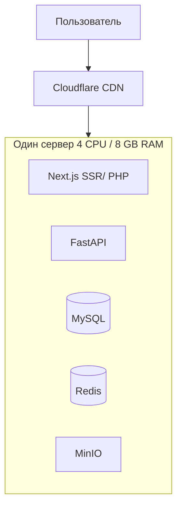
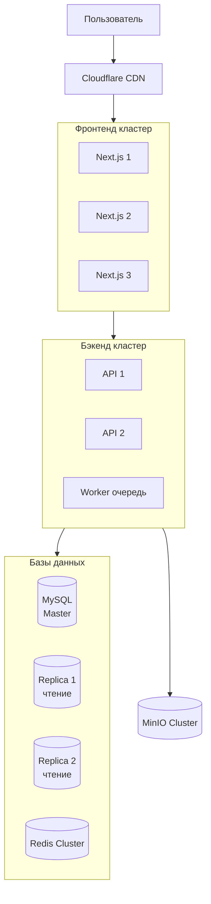

# АПС 2026 — Новостная платформа (News Platform)

## Архитектура ПС 2026 - Выработка требований

**Тема:** Модуль новостной платформы с пользовательским контентом

**Авторы:**

- Звелаке Масеко (Team Leader, Web Engineer)
- Ха Жа Кинь (Mobile Engineer)
- Гюнеш Мустафа (Frontend Designer)

**Группа:** 5130904/30103

---

## Функциональные требования

### 1. Основные функции модуля

- **Лента новостей:** Агрегация статей из двух источников:
  - *Внутренние статьи* (от авторов платформы)
  - *Внешние статьи* (из внешних API мировых новостных агентств)
- **Система авторов:** Пользователи могут оформить подписку и получить роль «Автор» для публикации своих статей.
- **Категории и теги:** Фильтрация ленты по разделам.
- **Поиск:** Полнотекстовый поиск по всем статьям (внутренним и внешним).
- **Система уведомлений:** Push-уведомления о новых статьях от любимых авторов.

### 2. Оценка аудитории

- **Суточная активная аудитория (DAU):** ~15 000 пользователей.
- **Активные авторы:** ~5-10% от аудитории (750-1500 человек при условии платной подписки).
- **Месячная аудитория (MAU):** ~45 000-60 000 пользователей.
- **Хранение данных:** 5–7 лет.

### 3. Пользовательские сценарии

#### 3.1. Чтение новостей (Читатель)

**Как читатель**, я хочу видеть единую ленту из статей авторов платформы и мировых новостей, чтобы быть в курсе всех событий.

- Пользователь заходит на главную страницу и видит смешанную ленту.
- Может отфильтровать по категории или источнику (только внутренние / только внешние).
- Может подписаться на конкретного автора.

#### 3.2. Получение роли автора (Пользователь -> Автор)

**Как пользователь**, я хочу оформить подписку и получить возможность публиковать свои статьи на платформе.

- Пользователь переходит в раздел «Стать автором».
- Выбирает тариф подписки (месяц/год) и оплачивает через платежную систему.
- После подтверждения оплаты, в личном кабинете появляется доступ к «Панели автора».

#### 3.3. Публикация статьи (Автор)

**Как автор**, я хочу написать и опубликовать статью, чтобы поделиться своим мнением с аудиторией.

- Автор заходит в «Панель автора» и создает новую статью (заголовок, текст, категория, обложка).
- Статья отправляется на модерацию (проверка на плагиат, соответствие правилам).
- После модерации статья появляется в общей ленте.

#### 3.4. Администрирование (Админ

**Как администратор**, я хочу управлять внешними API и модерировать статьи авторов.

- Подключение нового внешнего API (например, Reuters, BBC) через админ-панель.
- Просмотр очереди статей на модерацию (одобрить/отклонить).
- Управление тарифами подписки для авторов.

---

#### **(summary)**

1. **Регистрация и роли:**
   - Пользователь может зарегистрироваться в системе
   - Пользователь может оформить подписку и получить роль «Автор»
   - Администратор может управлять пользователями и ролями

2. **Управление контентом:**
   - Автор может создавать, редактировать и публиковать статьи
   - Автор может загружать изображения к статьям
   - Администратор может модерировать статьи (одобрять/отклонять)

3. **Агрегация новостей:**
   - Система загружает внешние новости через API мировых агентств
   - Система объединяет внутренние и внешние статьи в единую ленту

4. **Лента и фильтрация:**
   - Отображение ленты новостей с пагинацией
   - Фильтрация по категориям
   - Фильтрация по источнику (внутренние/внешние)
   - Полнотекстовый поиск по статьям

5. **Уведомления:**
   - Push-уведомления о новых статьях
   - Email-дайджесты
   - Подписка на конкретных авторов

6. **Платежи:**
   - Интеграция с платежными системами (Visa, Apple Pay, PayPal)
   - Оформление подписки на роль автора
   - История платежей в личном кабинете

---

## Бизнес-требования

Это цели и ценности для компании/продукта:

1. **Монетизация:**
   - Платная подписка для получения роли автора (recurring revenue)
   - Возможность в будущем ввести платный доступ к премиум-новостям
   - Комиссия с транзакций (если появятся платные статьи)

2. **Рост и удержание аудитории:**
   - Увеличение DAU до 15 000 пользователей (метрика роста)
   - Удержание пользователей через персонализированные уведомления
   - Создание UGC (User Generated Content) — пользователи сами генерируют контент, что снижает затраты на редакцию

3. **Конкурентное преимущество:**
   - Агрегация мировых новостей + уникальный контент от авторов (гибридная модель)
   - Сообщество авторов (как Medium или Habr)

4. **Операционные показатели:**
   - Время публикации статьи: не более 5 секунд после модерации
   - Доступность сервиса 99.5% (бизнес-риск потери рекламного дохода при простое)
   - Хранение данных 5-7 лет (юридические требования и аналитика)

5. **Маркетинг:**
   - Привлечение авторов через партнерские программы
   - Возможность таргетированной рекламы на основе категорий новостей

---

## Архитектура и проектирование

### 4. Детальные расчеты ресурсов

#### 4.1. Расчет трафика

**Входящий трафик (от сервера к пользователям):**

| Тип контента              | Расчет                                   | Итого в день    |
| ------------------------- | ---------------------------------------- | --------------- |
| Текстовые статьи          | 15 000 пользователей × 10 статей × 50 КБ | ~7.5 ГБ         |
| Изображения (превью)      | 15 000 × 20 изображений × 100 КБ         | ~30 ГБ          |
| Изображения (полные)      | 3 000 пользователей × 5 статей × 500 КБ  | ~7.5 ГБ         |
| CSS/JS/HTML               | 15 000 × 2 МБ                            | ~30 ГБ          |
| **Итого входящий трафик** |                                          | **~75 ГБ/день** |

**Исходящий трафик (от пользователей к серверу):**

| Тип операции                 | Расчет                                          | Итого в день     |
| ---------------------------- | ----------------------------------------------- | ---------------- |
| Публикация статей            | 500 авторов × 1 статья × 2 МБ (с изображениями) | ~1 ГБ            |
| Действия (лайки/комментарии) | 50 000 запросов × 1 КБ                          | ~50 МБ           |
| Загрузка аватарок            | 100 пользователей × 500 КБ                      | ~50 МБ           |
| **Итого исходящий трафик**   |                                                 | **~1.1 ГБ/день** |

#### 4.2. Расчет нагрузки на API (RPS)

**Чтение (Read):**

- Просмотр ленты: 15 000 пользователей × 5 заходов = 75 000 запросов/день = **~0.87 RPS**
- Просмотр статьи: 15 000 × 10 статей = 150 000 запросов/день = **~1.74 RPS**
- Поиск: 15 000 × 1 запрос = 15 000 запросов/день = **~0.17 RPS**
- **Пиковая нагрузка (x5 от средней):** **~14 RPS**

**Запись (Write):**

- Публикация статей: 500 авторов × 1 статья = 500 запросов/день = **~0.006 RPS**
- Комментарии/лайки: 15 000 × 2 = 30 000 запросов/день = **~0.35 RPS**
- Подписки: 50 новых авторов/день = **~0.0006 RPS**
- **Пиковая нагрузка (x5 от средней):** **~1.8 RPS**

**Итоговая пиковая нагрузка:** ~16 RPS (очень низкая, масштабирование потребуется при росте в 100+ раз)

#### 4.3. Расчет хранилищ

**Реляционная БД (MySQL/PostgreSQL):**

| Таблица               | Запись в день | Размер записи | Рост в год     | 5 лет       |
| --------------------- | ------------- | ------------- | -------------- | ----------- |
| users                 | 50 новых      | 1 КБ          | 18 МБ          | 90 МБ       |
| authors (подписки)    | 50 новых      | 500 Б         | 9 МБ           | 45 МБ       |
| articles (внутренние) | 500           | 50 КБ (текст) | 9.1 ГБ         | 45.5 ГБ     |
| comments              | 15 000        | 2 КБ          | 11 ГБ          | 55 ГБ       |
| **Итого БД**          |               |               | **~20 ГБ/год** | **~100 ГБ** |

**Объектное хранилище (S3/MinIO) для медиа:**

| Тип                | Загрузка в день | Размер     | Рост в год      | 5 лет        |
| ------------------ | --------------- | ---------- | --------------- | ------------ |
| Изображения статей | 500 × 2 МБ      | 1 ГБ/день  | 365 ГБ          | 1.8 ТБ       |
| Аватарки           | 50 × 500 КБ     | 25 МБ/день | 9 ГБ            | 45 ГБ        |
| **Итого медиа**    |                 |            | **~374 ГБ/год** | **~1.85 ТБ** |

**Кэш (Redis):**

- Топ-1000 статей: 1000 × 50 КБ = ~50 МБ
- Активные сессии: 15 000 × 2 КБ = ~30 МБ
- Ленты пользователей: 15 000 × 20 КБ = ~300 МБ
- **Итого RAM для кэша:** **~400-500 МБ** (рекомендуется 2 ГБ с запасом)

#### 4.4. Расчет пропускной способности сети

- **Средняя пропускная способность:** 75 ГБ/день = ~0.87 МБ/с = **~7 Мбит/с**
- **Пиковая пропускная способность (вечер, x5):** **~35 Мбит/с**
- **Резерв на рост (x10):** **~350 Мбит/с**

Вывод: Для старта достаточно канала 100-200 Мбит/с, при росте аудитории потребуется 500 Мбит/с - 1 Гбит/с.

### 5. Итоговое технологическое решение (Technology Stack)

#### 5.1. Фронтенд (Frontend)

| Компонент        | Технология                 | Обоснование                                    |
| ---------------- | -------------------------- | ---------------------------------------------- |
| Фреймворк        | Next.js (React)            | SSR для быстрой загрузки ленты, ISR для статей |
| CSS              | Tailwind CSS               | Быстрая разработка, кастомизация               |
| State Management | Zustand / React Query / JS | Кэширование запросов на клиенте                |

#### 5.2. Бэкенд (Backend)

| Компонент     | Технология                                | Обоснование                                   |
| ------------- | ----------------------------------------- | --------------------------------------------- |
| API-фреймворк | FastAPI (Python) / NestJS (Node.js) / PHP | Высокая производительность, автодокументация  |
| API Gateway   | Nginx / Traefik / Apache                  | Маршрутизация, rate limiting, SSL termination |
| Очереди задач | RabbitMQ / Celery                         | Асинхронная загрузка внешних новостей         |
| WebSockets    | Socket.io / FastAPI WebSocket / OneSignal | Уведомления в реальном времени                |

#### 5.3. Базы данных и хранилища

| Компонент           | Технология                 | Обоснование                                    |
| ------------------- | -------------------------- | ---------------------------------------------- |
| Основная БД         | MySQL 15+                  | Надежность, полнотекстовый поиск, JSONB        |
| Кэш                 | Redis 7+                   | Высокая скорость, TTL, Pub/Sub для уведомлений |
| Поисковый движок    | Elasticsearch / OpenSearch | Полнотекстовый поиск по миллионам статей       |
| Объектное хранилище | MinIO (self-hosted) / S3   | Хранение изображений, резервное копирование    |

#### 5.4. Инфраструктура (Infrastructure)

| Компонент       | Технология                                     | Обоснование                      |
| --------------- | ---------------------------------------------- | -------------------------------- |
| Контейнеризация | Docker + Docker Compose                        | Единое окружение для dev/prod    |
| Оркестрация     | Kubernetes (при росте) / Swarm                 | Масштабирование микросервисов    |
| CI/CD           | GitLab CI / GitHub Actions                     | Автоматическая сборка и деплой   |
| Мониторинг      | Prometheus + Grafana                           | Сбор метрик, алерты              |
| Логирование     | ELK Stack (Elasticsearch, Logstash, Kibana)    | Централизованный сбор логов      |
| CDN             | Cloudflare / AWS CloudFront / SpaceWeb Hosting | Раздача изображений, кэширование |

#### 5.5. Внешние интеграции

| Компонент        | Технология                           | Обоснование                       |
| ---------------- | ------------------------------------ | --------------------------------- |
| Платежи          | Stripe / ЮKassa / PayPal             | Подписки для авторов              |
| Внешние новости  | NewsAPI, GNews, RSS ленты            | Агрегация мировых новостей        |
| Email рассылки   | OneSignal                            | Дайджесты, уведомления            |
| Push-уведомления | Firebase Cloud Messaging / OneSignal | Мгновенные уведомления в браузере |

### 6. Схема деплоя и масштабирования

#### 6.1. Начальный этап (до 50 000 DAU)

#### 6.2. Этап масштабирования (100 000+ DAU)

### 7. Бюджетная оценка (месячная)

| Компонент               | Начальный этап               | Масштабирование (x10) |
| ----------------------- | ---------------------------- | --------------------- |
| Серверы (VPS/Dedicated) | 3000RUB                      |                       |
| Объектное хранилище     | 3000RUB                      | 10000RUB              |
| Платежный шлюз          | 2-3% от транзакций           | 2-3% от транзакций    |
| Внешние API новостей    | 0-100RUB (бесплатные тарифы) |                       |
| **Итого**               | **~6000RUB/мес**             | **~10000RUB/мес**     |

### 8. Выводы и рекомендации

1. **Стартовое железо:** Для 15 000 DAU достаточно одного сервера с 2 vCPU, 2 GB RAM, 10 GB SSD + отдельный диск для медиа.
2. **Узкие места:** Поиск статей и загрузка внешних API — требуют асинхронной обработки через очереди.
3. **Безопасность:** Обязательно использовать WAF (Cloudflare) и rate limiting для API публикации статей.
4. **Резервное копирование:** Ежедневный бэкап БД и медиа в S3 (хранение 30 дней + ежемесячные снапшоты).
